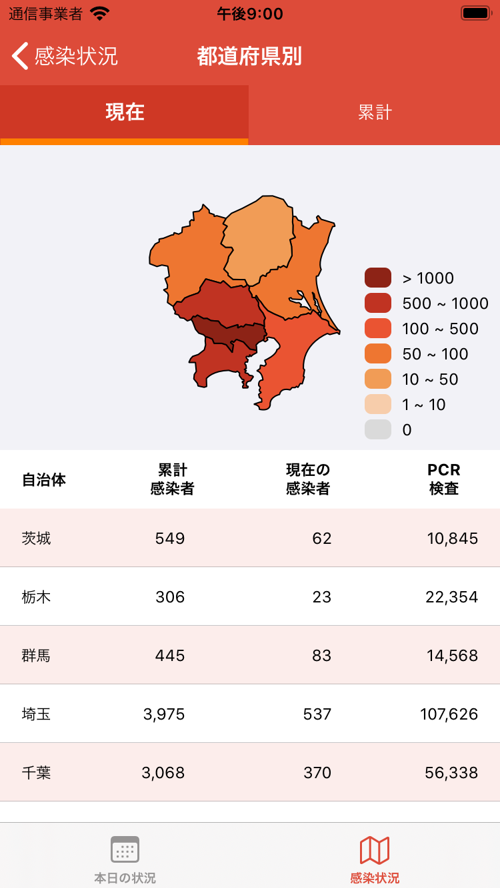

# CONAV
COVID-19 Japan Web API（データソース参照）を用いた国内の COVID-19 の情報を表示するアプリ

### 開発環境

### スクリーンショット
　　　

### 構成
Core モジュールをドメイン層としてアプリのロジックを持つような構成。

#### アプリ本体

| ディレクトリ名 | 目的 | 備考 |
|---|---|---|
| Configurations | 各環境の設定ファイル |  |
| Coordinator  | Coordinatorパターンによる画面遷移 |  |
| DI | Containerで各画面に必要なインスタン生成など |  |
| Extension  | 拡張 |  |
| Resource  | 文字や画像など |  |
| View  | UIや共通パーツ  |   |
| Viewmodel  | 画面反映のための伝搬役 |  |

#### Core モジュール

| ディレクトリ名 | 目的 | 備考 |
|---|---|---|
| Model  | アプリ内で使用するモデルクラス群 |  |
| Repository  | 通信処理の隠蔽 |  |
| API  | 通信処理やリクエストやレスポンス |  |
| UseCase  | アプリのロジック |  |

### ライブラリ

| 名前 | バージョン | 用途 | インストール方法 |
|---|---|---|---|
| [Alamofire](https://github.com/Alamofire/Alamofire) | 5.2 | 通信処理 | Carthage |
| [SVProgressHUD](https://github.com/SVProgressHUD/SVProgressHUD) | 2.2 | ローディング | Carthage |
| [ReactiveSwift](https://github.com/ReactiveCocoa/ReactiveSwift) | 6.1 | リアクティブ | Carthage |
| [ReactiveCocoa](https://github.com/ReactiveCocoa/ReactiveSwift) | 10.1 | リアクティブ | Carthage |
| [Charts](https://github.com/danielgindi/Charts) | 3.5 | グラフ表示 | Carthage |
| [Segmentio](https://github.com/Yalantis/Segmentio) | 3.0 | セグメント | Carthage |
| [R.swift.Library](https://github.com/mac-cain13/R.swift.Library) | 5.2 | リソース管理 | Carthage |
| [SwiftLint](https://github.com/realm/SwiftLint) | 0.39.2 | 静的解析 | CocoaPods |
| [SwiftFormat](https://github.com/nicklockwood/SwiftFormat) | 0.45.1 | コードフォーマット | CocoaPods |

＊RswiftはCarthage経由で導入しているため、R.swift.Libraryを使用しており、プロジェクト直下に実行ファイルが配置されています。

### 環境
| 名前 | 用途 |
|---|---|
| Debug-Development | 開発環境デバッグ用 |
| Debug-Staging | ステージング環境デバッグ用  |
| Debug-Production | 本番環境デバッグ用  |
| Release-Development | 開発環境リリース用 |
| Release-Staging | ステージング環境リリース用  |
| Release-Production | 本番環境リリース用  |

＊環境は分けていますが、APIの接続先を変えたり、処理を変えたりはしていないので、どれを使用しても変わりありません。

### データソース
- [ryo-ma/covid19-japan-web-api](https://github.com/ryo-ma/covid19-japan-web-api/blob/master/README.ja.md#data-sources)
- [swsoyee/2019-ncov-japan](https://github.com/swsoyee/2019-ncov-japan)
